# Programação de Funcionalidades

Nesta página descrevemos as técnologias e estrutura de dados utilizada no desenvolvimento do Grimore.

## Técnologias

Para que pudessemos atingir nosso objetivo com essa plataforma, foi escolhido um grupo de técnologias que se complementam e dão flexibilidade para o time no desenvolvimento das funcionalidades propóstas nesse projeto.

* **Node JS**: Utilizado para rodar o servidor de desenvolvimento e gerênciamento de pacótes.
* **Json Server**: Utilizado como provedor de dados, servidos a partir de arquivos Json
* **Handlebars**: Um sistema de template simples que permite a criação de blocos lógicos e diminui a repetição de código.
* **Sass**: Pre-processador de css
* **Jquery**: Para lógica client side em javascript
* **Bootstrap 5**: Framework para desenvolvimento frontend
* **HTML 5**: Para marcação de páginas e layout de páginas.

## Conceitos de desenvolvimento

Utilizamos o Handlebars para evitar o repetimento continuo de código, a plataforma contém mais de 30 páginas, sem o Handlebars, a manutenção do código seria mais complexa e mais propensa a erros.

O Handlebars trás 3 conceitos principais e largamente utilizados na plataforma:

### Templates

Com handlebars é possível separar as responsabilidades em arquivos e pastas dedicadas, tornando nosso código fonte mais limpo e coerente. Com isso, os dados das páginas ficam localizados em arquivos `.json` na pasta dados, e estão disponíveis em qualquer layout, bloco ou páginas do código.

A utilização destes dados começa por criar seu arquivo de dados dentro da pasta dados:

```json
// Arquivo: ./dados/usuario.json
{
    "nome": "John",
    "sobrenome": "Doe"
}
```

Com seu arquivo de dados criado, utilize os dados em uma de suas páginas, layouts ou blocos como abaixo:

```handlebars
{{#block "custom"}}
    <h2>{{usuario.nome}} {{usuario.sobrenome}}<h2>
{{/block}}
```

### Páginas

Páginas são os pontos de entrada da plataforma, e devem ser criadas dentro da pasta `pages`, a estrutura de pastas serve como roteamento sendo que as url's seguem a mesma esturtura.

Páginas criadas dentro de `/pages/secure` são protegidas por athenticação automaticamente se authenticação estiver habilitada.

### Layouts

Layouts são esqueletos de páginas, contendo apenas o html, css e javascript que são comuns em várias páginas, layouts são o principal block de construção de páginas, ele contem toda a estrutura html básica incluindo a tag html, head, body, ele já tem as chamadas necessárias para os arquivos do Bootstrap, além dos estilos e scripts básicos da plataforma.

Ao criar uma nova página na pasta `pages`, é necessário que extenda um dos layouts disponíveis na pasta `./layouts` como no exemplo abaixo:

```handlebars
{{#extend "default"}}
    <!-- ...blocks -->
{{/extend}}
```

Com o código acima, todo conteúdo de layout `./layouts/default.hbs` será renderizado em sua nova página, e tudo o que tem que fazer é customizar seus blocos.

```handlebars
{{#extend "default"}}
    <!-- Ao utilizar o bloco #content, substituimos o conteúdo do bloco "main" do layout "default". -->
    {{#content "main"}}
        <p class="text-white">Customizar Conteudo</p>
    {{/content}}

{{/extend}}
```

### Parciais (Partials)

Parciais são pedaços de html, uma pequena parte de uma página em um arquivo independente, que pode ser re-utilizado em vários layouts. Novas parciais devem ser salvas na pasta `./partials`, e seu conteúdo deve sempre começar com a declaração de nome do bloco:

```handlebars
<!-- Arquivo: ./partials/my-block.hbs -->
{{#block "my-block"}}
    <!-- Insira aqui o HTML deste bloco -->
{{/block}}
```

Uma vez criada uma parcial, ela pode ser importada em qualquer layout, outras parcias e outras páginas, utilizando a tag `#embed` da seguinte maneira:

```handlebars
{{#extend "default"}}
    {{#content "main"}}
        <!-- O conteúdo do bloco "main" do layout "default", será substituído pelo conteúdo de sua nova parcial "my-block". -->
        {{#embed "my-block"}}{{/embed}}
    {{/content}}

{{/extend}}
```

### Helpers

Helpers são exxtremamente úteis na formatação de conteúdo, como converter textos para caixa alta ou baixa, customizar html, e facilitar a criação de estruturas complexas.

Um helper é nada mais que uma função javascript em um arquivo dedicado, que recebe um contexxto e retorna conteúdo HTML em forma de uma string (texto).

Nossa plataforma já disponibiliza uma grande quantidade de helpers que podem ser usados, a lista completa pode ser conferida [aqui](https://www.npmjs.com/package/handlebars-helpers), em casos específicos que nenhum dos helpers disponíveis satisfação os requerimentos, um novo deverá ser criado na pasta `./src/helpers`.

## Estrutura de dados

Foram necessárias algumas estruturas de dados para a plataforma, abaixo descrevemos as mais importantes:

### Users

Estrutura base de perfíl de usuários na plataforma.

```json
{
    "id": "string",
    "createdAt": "Date",
    "gender": "string",
    "firstName": "string",
    "lastName": "string",
    "username": "string",
    "password": "string",
    "email": "string",
    "avatar": "url",
    "jobTitle": "string",
    "country": "string",
    "countryCode": "string",
    "age": "number",
    "state": "string",
    "bio": "string",
    "timeZone": "string",
    "website": "url"
}
```

### Technologies

Armazena todas as técnologias abordadas na plataforma, utilizadas como filtro nas telas e conteúdo.

```json
{
    "id": "string",
    "title": "string",
    "sub-title": "string",
    "slug": "string",
    "type": "string",
    "description": "string",
    "icon": "url",
    "website": "string",
    "areaId": "string"
}
```

### Tracks

Tracks são as possíveis linhas de estudo de um usuário.

```json
{
    "id": "string",
    "title": "string",
    "slug": "string",
    "icon": "url",
    "areaId": "string",
    "technologyId": "string"
}
```


### Topics

Cada track possuí seu conjundo de tópicos de estudo representados na estrutura abaixo.

```json
{
    "id": "string",
    "title": "string",
    "description": "string",
    "areaId": "string",
    "trackId": "string"
}
```

### Lessons

Cada tópico por sua vez, engloba uma ou mais lissões, com conteúdo diverso.

```json
{
    "id": "datatype.uuid",
    "endDate": "date",
    "title": "lorem.sentence",
    "content": "helpers.fake:## {{lorem.sentence}}|{{lorem.paragraph}}|{{lorem.paragraph}}|### {{lorem.sentence}}||{{lorem.paragraph}}|{{lorem.paragraph}}||### {{lorem.sentence}}|{{lorem.paragraph}}|{{lorem.paragraph}}|{{lorem.paragraph}}|||## {{lorem.sentence}}|{{lorem.paragraph}}|{{lorem.paragraph}}|{{lorem.paragraph}}|{{lorem.paragraph}}",
    "topicId": "one-to-one:topics.id"
}
```

## Screenshots

As screenshots abaixo demonstram algumas das páginas mais importantes da aplicação e seus arquivos fonte, desenvolvidas utilizando as técnologias descritas nesta página e utilizando a esturtura de dados propósta.

### Home Page

_/src/pages/index.hbs_
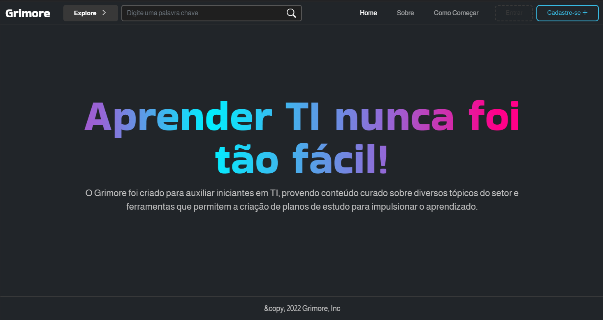
(RF-003 -> RF-007)

### Sobre o projeto

_/src/pages/about.hbs_
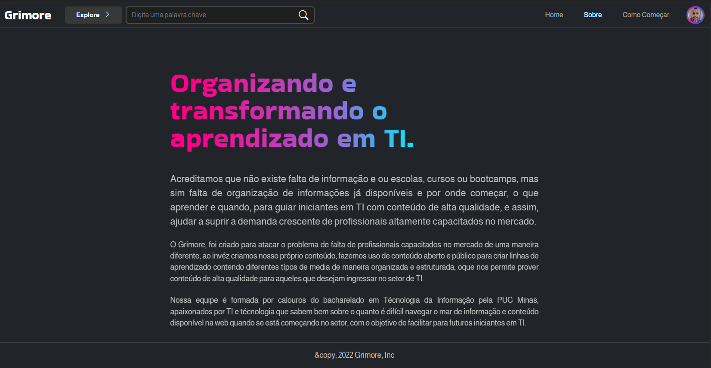
(RF-001)

### Como funciona

_/src/pages/how-it-works.hbs_
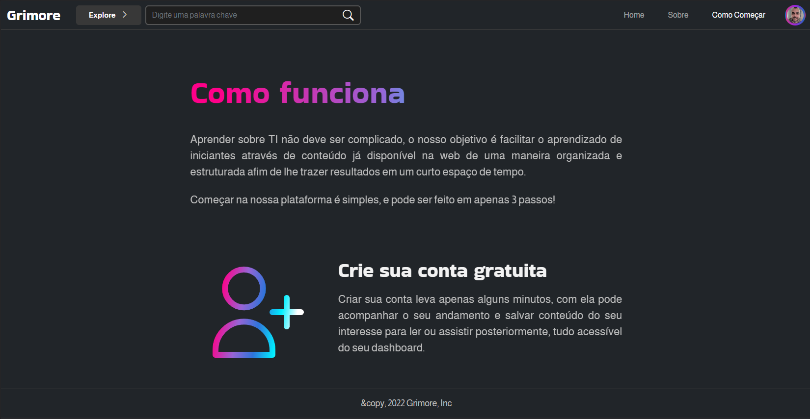
(RF-002)

### Buscar Conteúdo

_/src/pages/index.hbs_
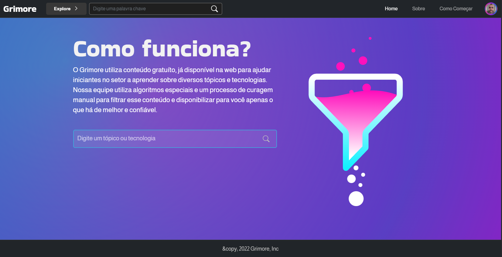

### Videos

_/src/pages/search/index.hbs_
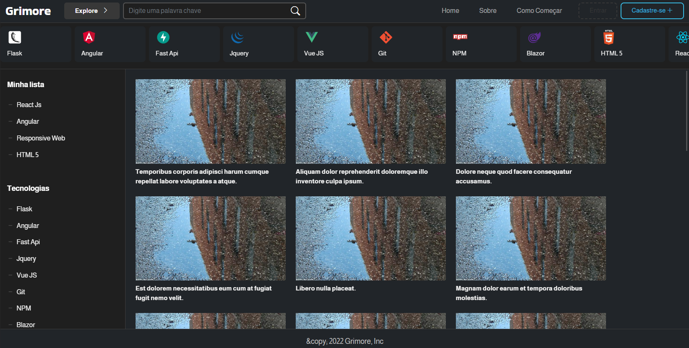
(RF-008)

### Videos por technologia

_/src/pages/search/index.hbs_
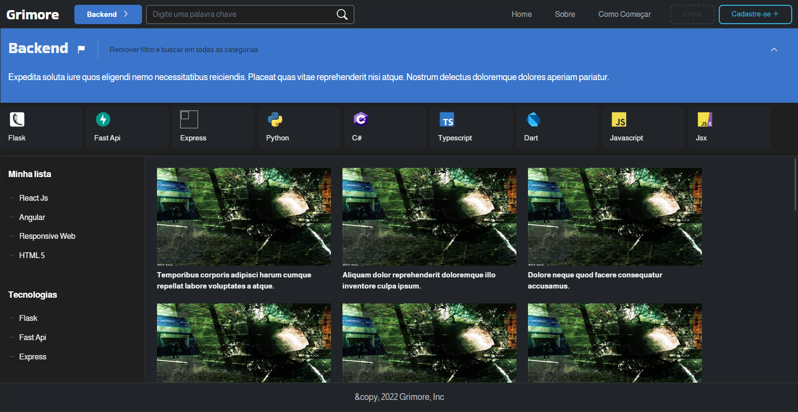

### Cadastro

_/src/pages/search/sign-up/index.hbs_
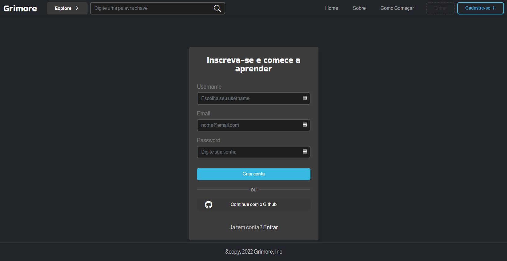
(RF-013 até RF-015)

### Login

_/src/pages/search/sign-in.hbs_
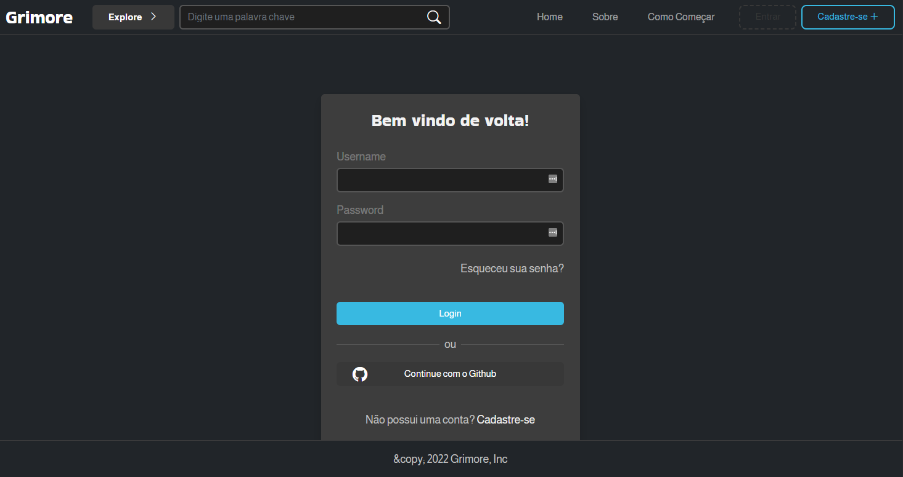
(RF-009 até RF-012)

### Criar plano de estudos

_/src/pages/secure/new/track/index.hbs_
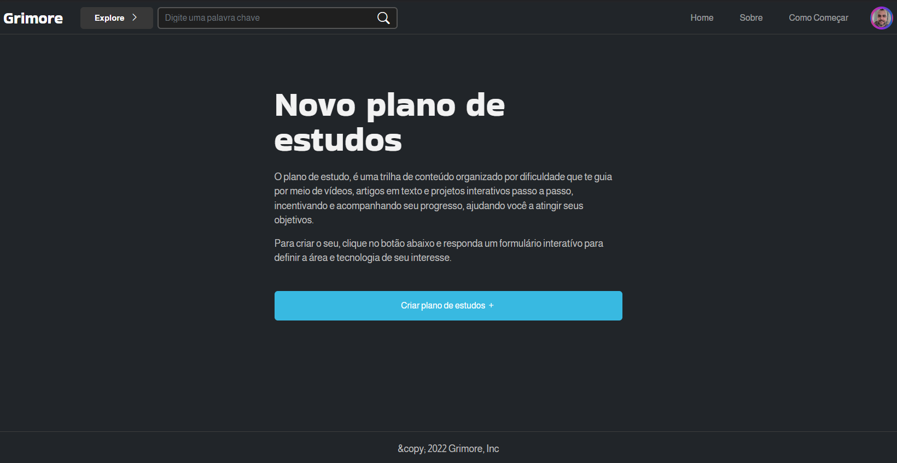
(RF-034 e RF-036)

### Escolha de technologia

_/src/pages/secure/new/track/tech.hbs_
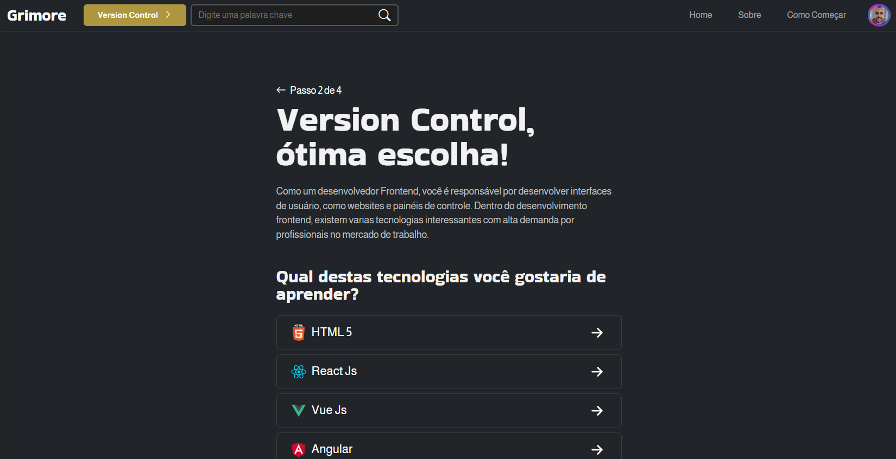
( RF-035)

### Plano de estudos

_/src/pages/secure/tracks/[trackId]/index.hbs_
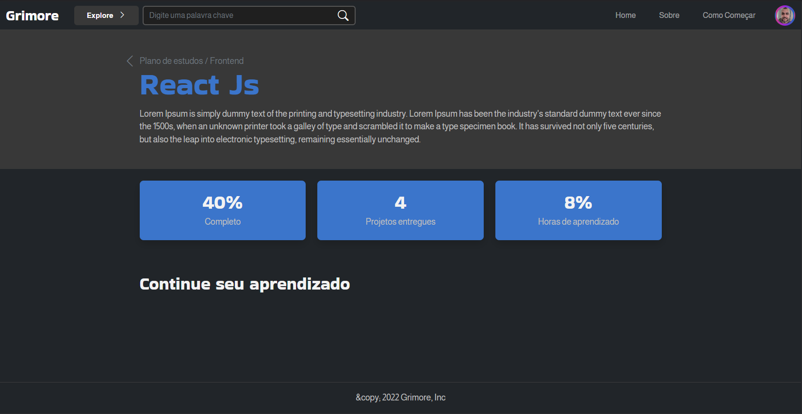

### Tópico de estudo

_/src/pages/secure/tracks/[trackId]/[topicId].hbs_

