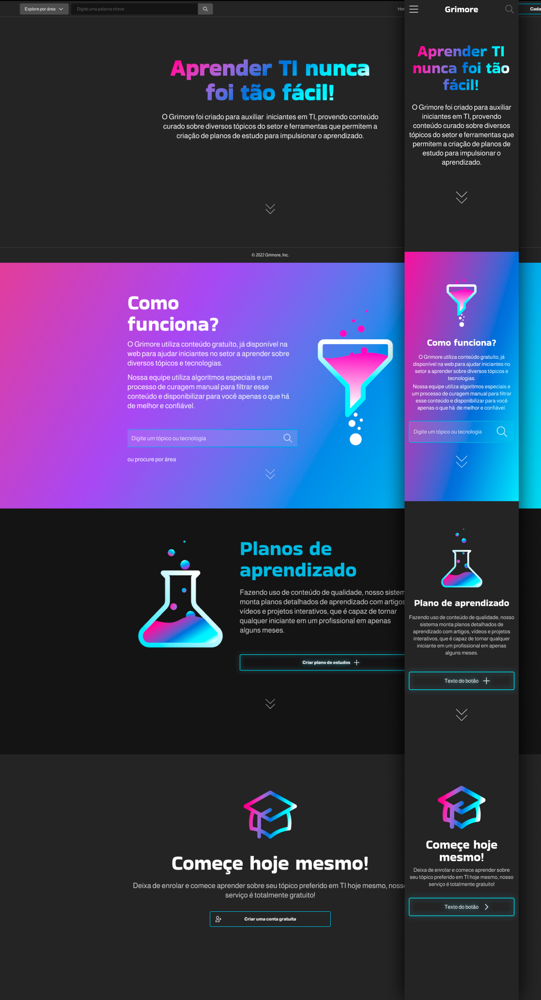

# **Grimore - Projeto de Interface**

Para atender a todos os requisitos envisionados durante a etapa de contexto do projeto, nossa equipe desenvolveu uma interface moderna com foco em leitura e apendizado, afim de promover um ambiente confortável e empolgante nossos usuários.

## Identidade visual

Após uma pesquisa, descidimos aderir um tema escuro por padrão, por ser mais confortável para leitura, além de refletir uma aparência mais moderna o que se alinha bem com nosso tema em tecnologia..

## Home

A página inicial é a principal entrada da plataforma, responsável por prover informações gerais sobre o objetivo da plataforma e dar acesso a outras páginas incluíndo páginas Sobre, Como funciona, Login e Cadastro. Nela você também acesso a fazer pesquisas por via categorias ou palavras chave (RF-001 à RF-007).

## User Flow

Fluxo de usuário (User Flow) é uma técnica que permite ao desenvolvedor mapear todo fluxo de telas do site ou app. Essa técnica funciona para alinhar os caminhos e as possíveis ações que o usuário pode fazer junto com os membros de sua equipe.

> **Links Úteis**:
> - [User Flow: O Quê É e Como Fazer?](https://medium.com/7bits/fluxo-de-usu%C3%A1rio-user-flow-o-que-%C3%A9-como-fazer-79d965872534)
> - [User Flow vs Site Maps](http://designr.com.br/sitemap-e-user-flow-quais-as-diferencas-e-quando-usar-cada-um/)
> - [Top 25 User Flow Tools & Templates for Smooth](https://www.mockplus.com/blog/post/user-flow-tools)

## Wireframes

<<<<<<< Updated upstream

São protótipos usados em design de interface para sugerir a estrutura de um site web e seu relacionamentos entre suas páginas. Um wireframe web é uma ilustração semelhante do layout de elementos fundamentais na interface.
 
> **Links Úteis**:
> - [Protótipos vs Wireframes](https://www.nngroup.com/videos/prototypes-vs-wireframes-ux-projects/)
> - [Ferramentas de Wireframes](https://rockcontent.com/blog/wireframes/)
> - [MarvelApp](https://marvelapp.com/developers/documentation/tutorials/)
> - [Figma](https://www.figma.com/)
> - [Adobe XD](https://www.adobe.com/br/products/xd.html#scroll)
> - [Axure](https://www.axure.com/edu) (Licença Educacional)
> - [InvisionApp](https://www.invisionapp.com/) (Licença Educacional)
=======
A parte de plano de estudos é composta pela criação*, onde o usuário seleciona o assunto, a tecnologia desejada e a disponibilidade de estudo, e pelo acompanhamento, que prove o conteúdo em si daquele plano e informações adicionais como o progresso no plano. (RF-034 à RF-033)

## Dashboard & Perfil

Após sua autenticação, o usuário é levado ao seu Dashboard, contendo informações sobre seus planos de estudo em andamento e aqueles já concluídos, além de suas informações pessoais como nome, email e links sociais, que complementam seu perfil público, com um overview de suas características e seu progresso na plataforma. (RF-021 à RF-036)
# User Flow

<h3>Menu inicial</h3>

<h3>Pesquisa de conteúdo</h3>

<h3>Plano de estudo personalizado</h3>

<h3>Criação de Conta</h3>

<h3>Autenticação</h3>

<h3>Recuperação de senha</h3>

>>>>>>> Stashed changes
