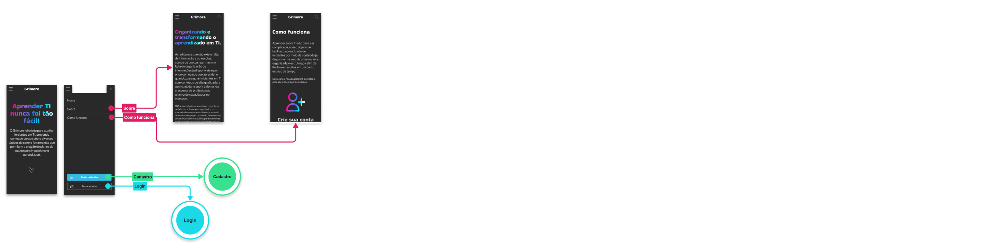
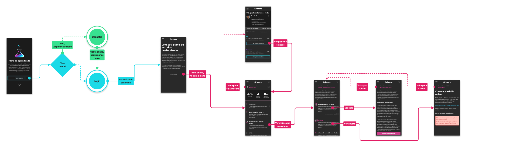
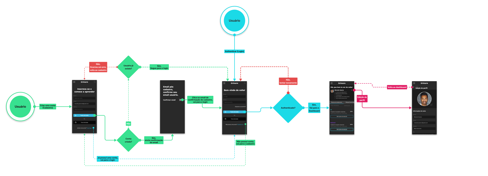
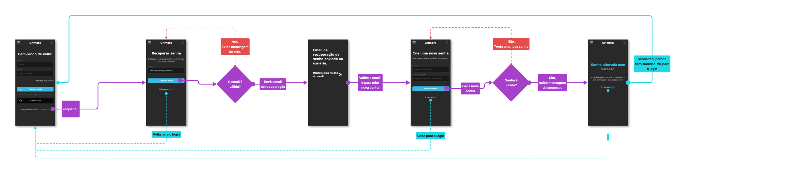

# **Grimore - Projeto de Interface**

Para atender a todos os requisitos envisionados durante a etapa de contexto do projeto, nossa equipe desenvolveu uma interface moderna com foco em leitura e apendizado, afim de promover um ambiente confortável e empolgante nossos usuários.

## Identidade Visual

Após uma pesquisa, descidimos aderir um tema escuro por padrão, por ser mais confortável para leitura, além de refletir uma aparência mais moderna o que se alinha bem com nosso tema em tecnologia.

### Cores

Uma paleta de cores extensa foi utilizada para enriquecer a experiência do usuário, utilizamos cores para identificação visual de categorias na página de pesquisa e planos de estudo, onde cada área (Frontend, Backend, DevOps, etc...) tem sua cor que decora textos e outras seções da plataforma inidcando visualmente para o usuário a seção em que el se encontra.

### Icones

Para icnonografia a plataforma utiliza o Bootstrap icons, que oferece uma variedade de icones modernos que

    

### Tipografia

Para textos a plataforma utiliza duas fontes, uma de mais impacto para títulos e logotipo, e outra mais simples para textos de corpo como paragraphos, listas e tabelas.

## Páginas

### Home

    

A página inicial é a principal entrada da plataforma, responsável por prover informações gerais sobre o objetivo da plataforma e dar acesso a outras páginas incluíndo páginas Sobre, Como funciona, Login e Cadastro. Nela você também acesso a fazer pesquisas por via categorias ou palavras chave (RF-001 à RF-007).

### Pesquisa de conteúdo

Já na página de busca, a interface contém uma seleção de vídeos préviamente curados, e permite a pesquisa por meio de palavras chave e filtragem por categoria, retornando resultados coerentes a solicitação do usuário (RF-008). Nela o usuário também tem acosso a um menu para navegar seus conteúdos previamente salvos.

### Páginas protegidas

As páginas a seguir são protegidas por autenticação, assim a plataforma prove meios para criação de conta, login e recuperação de senha por meio de formulários modernos e intuitívos, além da facilidade de utilizar a conta do Github para criar conta e subsequentemente se authenticar na plataforma.
(RF-009 à RF-020)

### Planos de estudo

A parte de plano de estudos é composta pela criação, onde o usuário seleciona o assunto, a tecnologia desejada e a disponibilidade de estudo, e pelo acompanhamento, que prove o conteúdo em si daquele plano e informações adicionais como o progresso no plano. (RF-034 à RF-033)

### Dashboard & Perfil

Após sua autenticação, o usuário é levado ao seu Dashboard, contendo informações sobre seus planos de estudo em andamento e aqueles já concluídos, além de suas informações pessoais como nome, email e links sociais, que complementam seu perfil público, com um overview de suas características e seu progresso na plataforma. (RF-021 à RF-036)

## User Flow

### Menu principal

O menu principal dá aos usuários da plataforma uma maneira fácil de navegar as diversas áreas da aplicação.

### Pesquisa de conteúdo

A pesquisa o flow é simples, onde o usuário busca por conteúdo, assiste vídeos e repete o fluxo.

### Plano de estudo personalizado

A criação de plano é uma área protegida, logo usuários precisam estar authenticados, o fluxo então guia o usuário pela criação de uma conta ou login caso já tenha a conta antes da criação de um novvo plano.

### Criação de Conta

A chamada de ação na página Home tem o intuito de convencer usuários a criarem sua conta na plataforma logo na primeira visita.

### Autenticação

Este fluxo é utilizado em outros fluxos acima, diferênciamos o cadastro do login pelas cores e os circulos de entrada do usuário.

### Recuperação de senha

A recuperaçao de senha guia o usuário a redefinir sua senha caso a tenha esquecido, trazendo o usuário de volta ao login ao final do processo para re-authenticação.

