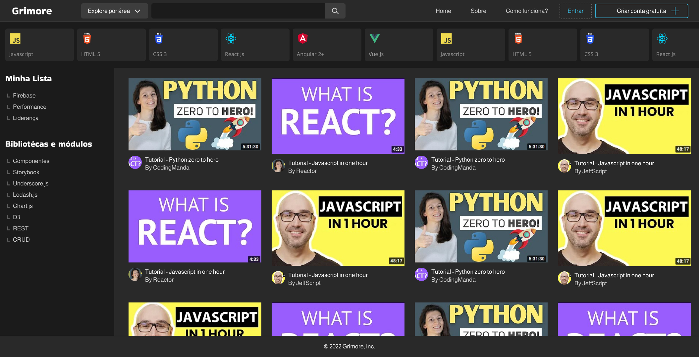

# **Grimore**

# **Wireframe**

Para atender a todos os requisitos envisionados durante a etapa de contexto do projeto, nossa equipe desenvolveu uma interface moderna com foco em leitura e apendizado, afim de promover um ambiente confortável e empolgante nossos usuários.

## Identidade visual

Após uma pesquisa, descidimos aderir um tema escuro por padrão, por ser mais confortável para leitura, além de refletir uma aparência mais moderna o que se alinha bem com nosso tema em tecnologia..

## Home

A página inicial é a principal entrada da plataforma, responsável por prover informações gerais sobre o objetivo da plataforma e dar acesso a outras páginas incluíndo páginas Sobre, Como funciona, Login e Cadastro. Nela você também acesso a fazer pesquisas por via categorias ou palavras chave (RF-001 à RF-007).

## Pesquisa de conteúdo

Já na página de busca, a interface contém uma seleção de vídeos préviamente curados, e permite a pesquisa por meio de palavras chave e filtragem por categoria, retornando resultados coerentes a solicitação do usuário (RF-008). Nela o usuário também tem acosso a um menu para navegar seus conteúdos previamente salvos. 

## Páginas protegidas

As páginas a seguir são protegidas por authenticação, assim a plataforma prove meios para criação de conta, login e recuperação de senha por meio de formulários modernos e intuitívos, além da facilidade de utilizar a conta do Github para criar conta e subsequentemente se authenticar na plataforma.
(RF-009 à RF-020)