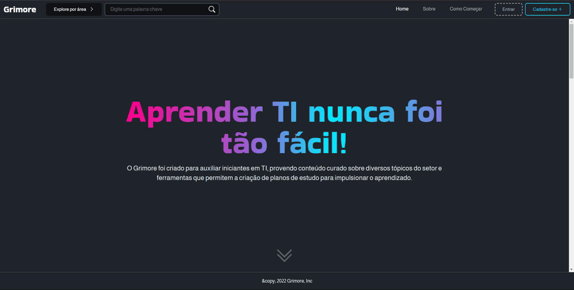
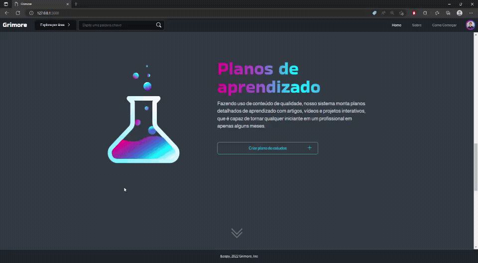
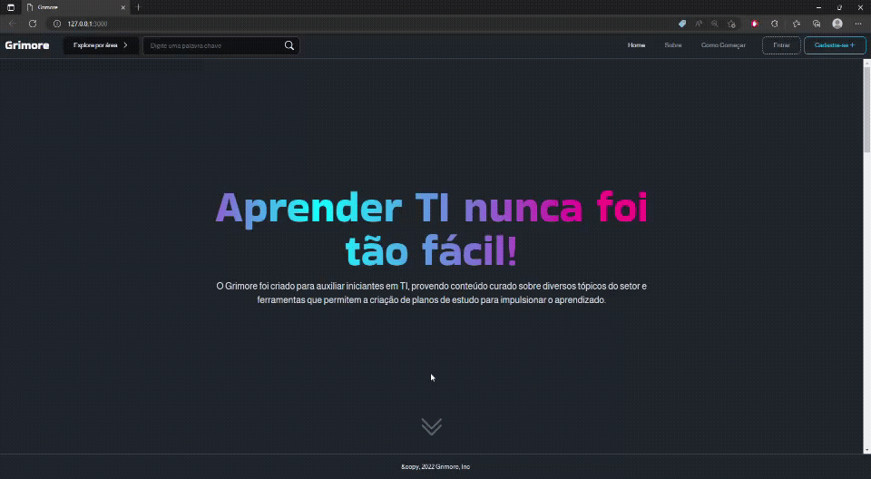

### Testes de funcionalidade

| Logar na plataforma                                                               |
| --------------------------------------------------------------------------------- |
|                                                          |
| Descrição: A plataforma permite que o usuário faça login com os dados cadastrados |
| Pré-Requisito: Não estar logado                                                   |
| Requisito(s): RF-009 - RF-012 e RF-005                                            |

> **Passo a passo:**
>
> 1. Clicar no botão "Entrar" no cabeçalho
> 2. Preencher os campos com os dados cadastrados
> 3. Clicar no botão "Login"

---

| Logar na plataforma (GitHub)                                                     |
| -------------------------------------------------------------------------------- |
|                                                          |
| Descrição: A plataforma permite que o usuário faça login com uma conta do GitHub |
| Pré-Requisito: Não estar logado                                                  |
| Requisito(s): RF-009 - RF-012 e RF-005                                           |

> **Passo a passo:**
>
> 1. Clicar no botão "Entrar" no cabeçalho
> 2. Clicar no botão "Continuar com GitHub"
> 3. Permitir o aplicativo na conta do GitHub (Caso seja a primeira vez logando)
> 4. Confirmar o email (Caso seja a primeira vez logando)

---

| Cadastro na plataforma                                       |
| ------------------------------------------------------------ |
|                                      |
| Descrição: A plataforma permite que o usuário crie uma conta |
| Pré-Requisito: Não possuir conta na plataforma               |
| Requisito(s): RF-013 - RF-015                                |

> **Passo a passo:**
>
> 1. Clicar no botão "Cadastre-se" no cabeçalho
> 2. Preencher os dados do formulário
> 3. Clicar no botão "Criar conta"
> 4. Confirmar o email
> 5. Fazer login

---

| Páginas sobre e como funciona                                                               |
| ------------------------------------------------------------------------------------------- |
|                                                                    |
| Descrição: A plataforma possui as páginas sobre e como funciona para informações adicionais |
| Pré-Requisito: Nenhum                                                                       |
| Requisito(s): RF-001 - RF-002                                                               |

> **Passo a passo:**
>
> 1. Clicar no botão "Sobre" ou "Como começar" no cabeçalho

---

| Criar plano de estudos                                                                           |
| ------------------------------------------------------------------------------------------------ |
|                                                                       |
| Descrição: A plataforma possibilita a criação de planos de estudos personalizados pelos usuários |
| Pré-Requisito: Estar logado                                                                      |
| Requisito(s): RF-034                                                                             |

> **Passo a passo**
>
> 1. Clicar no botão "Criar plano de estudos" disponível na home e tela de perfil do usuário.
> 2. Selecionar área de interesse para os estudos.
> 3. Escolher tecnologia para aprofundamento.
> 4. Selecionar qual disponibilidade diária para os estudos.
> 5. Confirmar criação do plano.

---

| Acompanhamento progressivo do plano de estudos                                                         |
| ------------------------------------------------------------------------------------------------------ |
|                                                                               |
| Descrição: O usuário pode visualizar o progresso do curso na medida que completa as etapas necessárias |
| Pré-Requisito: Estar logado e ter um plano já criado                                                   |
| Requisito(s): RF-022 e RF-023                                                                          |

> ##### Passo a passo:
>
> 1. No perfil, clicar no plano desejado.
> 2. Na visualizaçaõ das etapas do plano de estudos, clicar na etapa para ser estudada.
> 3. Ao terminar os estudos da etapa, clicar no botão "Marcar como concluído" no final da página.
> 4. Na tela de visualização das etapas visualizar o progresso.

---

| Busca de videos                                                                                                     |
| ------------------------------------------------------------------------------------------------------------------- |
|                                                                                               |
| Descrição: No header da plataforma o usuário pode realizar a busca por videos desejados a partir de palavras-chaves |
| Pré-Requisito: Nenhum                                                                                               |
| Requisito(s): RF-008                                                                                                |

> **Passo a passo**
>
> 1. Selecionar o campo de pesquisa no header da página.
> 2. Digitar palavras-chaves para retorno do conteúdo desejado.
